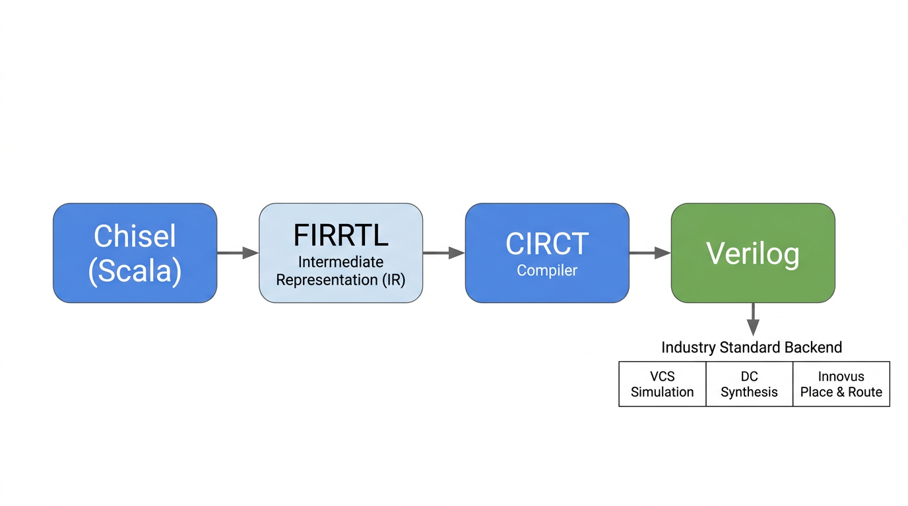

# Chapter 1: Chipyard Environment Setup -- Clone, Initialize, and Toolchain Configuration

## 1. Introduction

Starting from this chapter, we get our hands dirty. The prerequisite is that everything from the prep chapter is already in place -- WSL2 is running, the TUN proxy is on, and VSCode is connected to WSL2.

This chapter covers two things: first, understand how Chipyard is organized from a high level; then get the environment up and running. The operations themselves are not complicated -- mostly waiting. But if you don't know what each step is doing, the waiting becomes painful, and when something goes wrong you won't know where to look.

---

## 2. Understanding What Chipyard Is

### What Chipyard Can Do

Chipyard is not just a processor -- it is a complete research infrastructure spanning from RTL design all the way to tapeout. Its core philosophy: get the common building blocks right (processor cores, buses, peripherals, toolchains) so that researchers can focus on their own innovations.

Here are some concrete examples of what you can do once you learn Chipyard:

Attach a custom matrix-multiply accelerator next to a Rocket Core (via the RoCC interface), run neural network inference with hardware-software co-design, and quantify the speedup -- this is the most common use case for researchers working on AI accelerators. Or tweak the processor's cache parameters (capacity, associativity, replacement policy), run simulations to compare performance across different configurations, and support architecture research. You can also bring up the design on an FPGA and actually boot Linux on your processor, running real software -- this is one of the core goals of this series, and later chapters will walk through it step by step. Or go all the way through the Hammer flow to the physical design backend, pushing the design from Chisel source code to GDS. Many works published at ISCA and MICRO use Chipyard as their prototyping and validation platform.

### The Chisel to FIRRTL to Verilog Compilation Flow

Hardware in Chipyard is written in Chisel (a hardware description language embedded in Scala), not traditional Verilog. This is worth explaining.

Verilog describes "a specific circuit," while Chisel describes "a program that can generate circuits." Take a processor as an example: different configurations of Rocket Core (single-issue / multi-issue, different cache sizes, with or without FPU) can all be generated from the same Chisel codebase by changing parameters. In Verilog, you would need to maintain multiple near-duplicate copies of the code. This "generator mindset" is the fundamental source of Chipyard's flexibility.

The compilation flow is: Chisel source code -> FIRRTL (a hardware intermediate representation, analogous to IR in a software compiler) -> standard Verilog, produced by the CIRCT toolchain. Once you have Verilog, you can plug into any industry-standard backend tool flow (VCS simulation, Design Compiler synthesis, Innovus place-and-route) -- there is no difference from a design written directly in Verilog.

This series will not dive deep into Chisel syntax, but if you want to learn it systematically, the recommended resource is UCB's official [Chisel Bootcamp](https://github.com/freechipsproject/chisel-bootcamp) -- Jupyter Notebook format, runnable online. A Chinese translation by the Tsinghua Chengying project team is available at [chisel-bootcamp Chinese version](https://github.com/reoLantern/chisel-bootcamp).



### Main Directory Structure

After cloning, take a quick look at the directory layout -- it will help with everything that follows:

| Directory | Purpose |
|-----------|---------|
| `generators/` | Chisel source code for processor cores and accelerators (Rocket, BOOM, Gemmini, etc.) |
| `sims/` | Simulation entry point -- this is where you run simulations (`verilator/` and `vcs/` subdirectories) |
| `toolchains/` | RISC-V cross-compilation toolchain |
| `software/` | Software that runs on the processor (bare-metal test programs, Linux workloads, etc.) |
| `vlsi/` | Tapeout backend (Hammer flow) |
| `fpga/` | FPGA prototyping |
| `env.sh` | Script you must source every time you enter the working environment |

---

## 3. Cloning Chipyard

It is recommended to clone into your WSL2 home directory. **Do not place it under `/mnt/`**. The reason is that `/mnt/` mounts the Windows filesystem, whose IO performance is much slower than the native Linux filesystem -- the difference becomes very noticeable when building large projects.

```bash
git clone https://github.com/ucb-bar/chipyard.git
cd chipyard
```

---

## 4. Initialization: What build-setup.sh Does

Run the initialization script:

```bash
./build-setup.sh
```

This script performs the following steps in order:

**Step 1: Set up the Conda environment.** Chipyard has very precise version requirements -- specific versions of Java, Scala, Python packages. If versions are wrong, the build will fail outright. Conda (a cross-platform package manager) locks down all dependency versions in an isolated environment, completely separate from the system. This is why we don't just `apt install` things: apt installs the latest system version, which is very likely to mismatch what Chipyard requires.

**Step 2: Initialize submodules.** Chipyard is a large monorepo. Rocket Chip, BOOM, Gemmini, and others are each independent Git subrepositories. This step clones them all -- there are many and they are large, so it takes a while.

**Step 3: Build the RISC-V toolchain.** This builds `riscv64-unknown-elf-gcc` (the RISC-V cross-compiler, used to compile C programs into binaries that run on a RISC-V processor) and other tools from source. This is the most time-consuming step of the entire initialization -- it involves compiling GCC from source, which can take 30 minutes to an hour depending on your machine.

**Step 4: Pre-compile Scala sources.** The first Chisel/SBT build is very slow (SBT is the Scala build tool). Pre-compiling saves time on every subsequent launch.

**Step 5: Install CIRCT.** The compiler backend for Chisel, responsible for converting FIRRTL into standard Verilog.

The whole process takes 1--3 hours, depending on network speed and machine performance. Keep the TUN proxy on; no extra action is needed -- just wait.

---

## 5. Activating the Environment

After initialization is complete, **every time you open a new terminal to work with Chipyard**, you need to run:

```bash
source env.sh
```

This command does two things: activates the Conda environment and adds the RISC-V toolchain path to PATH. After running it, the terminal prompt will show the Conda environment name (something like `(.conda-env)`), indicating successful activation.

If you forget to source, subsequent build and simulation commands will report "tool not found" errors -- this is the most common issue. If you hit it, check this step first.

---

## 6. Verifying the Toolchain

After `source env.sh`, check that the key tools are working:

```bash
riscv64-unknown-elf-gcc --version   # RISC-V cross-compilation toolchain
spike --help 2>&1 | head -1         # ISA-level simulator, first line shows version info
verilator --version                 # RTL simulator
```

If all three commands produce version information, the environment is ready. As a reference, my environment shows GCC 13.2.0, Spike 1.1.1-dev, and Verilator 5.022. Your exact versions may differ -- as long as you get output, you are good to go.

---

## 7. Wrapping Up

At this point, the Chipyard environment is set up and the toolchain is sorted out. There are not many pitfalls in the process -- it is mostly about waiting and understanding what each step does.

Next up: **Chapter 2: Your First Rocket Core -- Running a Hello World Simulation**, where we dive into the actual hardware simulation workflow.
