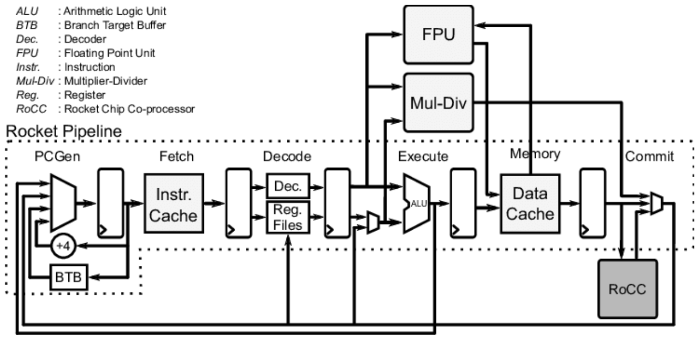
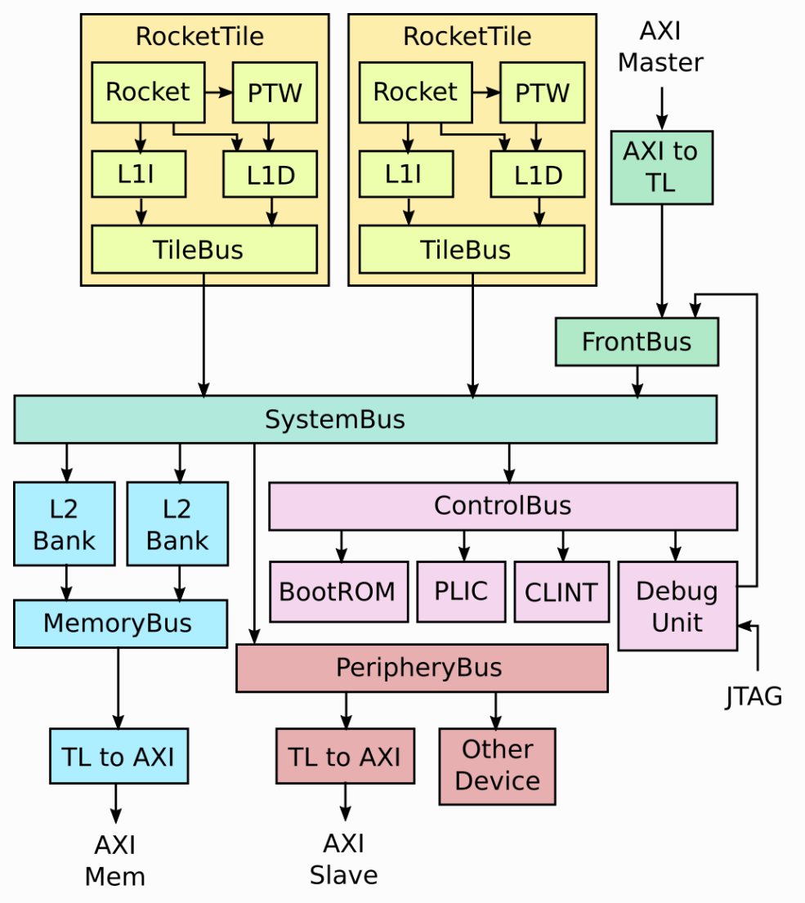
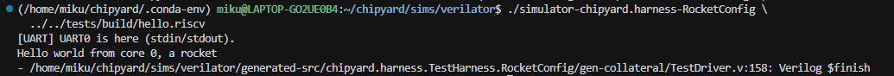
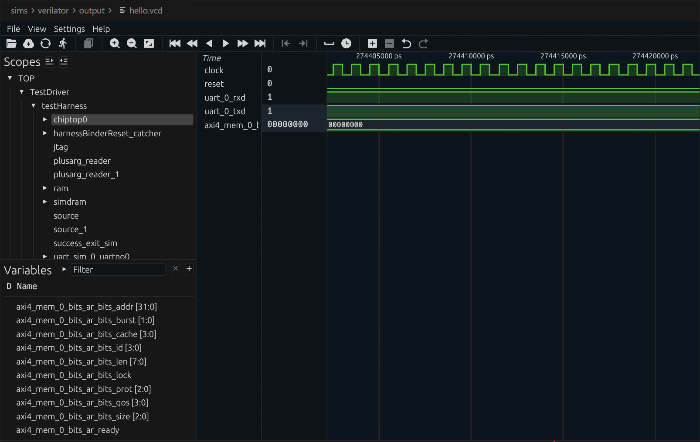

# Chapter 2: Your First Rocket Core -- Running Hello World in Simulation

---

## 1. Introduction

Last chapter we got the environment set up and verified the toolchain. This time we're doing something pretty cool: **running a real RISC-V application on a processor that's simulated entirely in software**.

Building a processor from scratch and getting your first program to run on it is typically a semester-long journey. With Chipyard, you can do it today. You'll see "Hello world from core 0, a rocket" printed in your terminal -- output from a full RISC-V processor core, all running on your own machine.

The simulator we'll use is Verilator -- open-source and free. Anyone can follow along; no commercial EDA license required.

---

## 2. The Complete Simulation Flow

Let's start with a fundamental question: **what does it mean to simulate a processor in software?**

We don't have a physical RISC-V chip on hand, but we can use software to precisely model its behavior -- every clock cycle, every signal transition, all executed according to the hardware description language specification. This is RTL simulation (Register Transfer Level simulation). Its results are fully equivalent to real silicon. It's the standard method for verifying hardware design correctness and a critical step every chip must go through before tape-out.

The simulation flow in Chipyard looks like this:

```
Chisel source code (under generators/ directory)
    ↓ SBT build + CIRCT
Verilog (under sims/verilator/generated-src/ directory)
    ↓ Verilator compilation
C++ executable simulator
    ↓ Run
Simulation output (terminal prints / waveform files)
```

Verilator converts Verilog into equivalent C++ code, then compiles it into a native executable. This is much faster than traditional event-driven simulators (like ModelSim) and is well-suited for running complete software programs.

If you want to see what the generated Verilog looks like, after running `make` you can browse the `sims/verilator/generated-src/chipyard.harness.TestHarness.RocketConfig/gen-collateral/` directory. It contains `.sv` files for every module -- things like `AMOALU.sv`, `ICache.sv` -- all auto-generated from Chisel, fundamentally no different from hand-written Verilog.

---

## 3. Rocket Core Architecture

Before running the simulation, let's understand what we're actually simulating.

**Rocket Core** is an open-source in-order 5-stage pipeline RISC-V processor core from UCB, implementing the RV64GC instruction set (64-bit integer, multiply/divide, floating-point, and compressed instructions). An in-order 5-stage pipeline means instructions execute sequentially with no out-of-order issue -- a relatively simple structure that makes a good baseline configuration for research.

Its Chisel source code lives under `generators/rocket-chip/src/main/scala/rocket/`. Key files:

| File | Contents |
|------|----------|
| `Core.scala` | Pipeline top level, wiring all stages together |
| `Frontend.scala` | Fetch frontend, includes branch prediction |
| `ICache.scala` | Instruction cache |
| `DCache.scala` | Data cache |
| `ALU.scala` | Arithmetic logic unit |
| `CSR.scala` | Control and status registers (privilege levels, interrupts, etc.) |

The Rocket Core pipeline structure is shown below -- Fetch, Decode, Execute, Memory, and Commit stages. If you've taken a computer architecture course, this should look familiar. In the diagram, PCGen is the address generation portion of the Fetch stage and isn't counted as a separate stage. Attached alongside are the FPU, Mul-Div unit, and the **RoCC (Rocket Custom Co-processor) interface** for connecting custom accelerators:



The RoCC interface in the lower-right corner of the diagram is the key entry point for attaching custom accelerators later on. If you're curious, you can open `Core.scala` and use this diagram to understand how all the modules are connected.

---

## 4. RocketConfig: Building-Block SoC Configuration

Chipyard uses **Configs** to describe the composition of an entire SoC. Different Configs correspond to different hardware configurations. The definition of `RocketConfig` is in `generators/chipyard/src/main/scala/config/RocketConfigs.scala`. Let's take a look:

```scala
class RocketConfig extends Config(
  new freechips.rocketchip.rocket.WithNHugeCores(1) ++  // One Rocket Core
  new chipyard.config.AbstractConfig)                   // Base SoC peripherals (bus, memory, UART, etc.)
```

Just two lines -- stack a Rocket Core on top of the base SoC configuration. The same file contains other Configs you can compare:

```scala
class DualRocketConfig extends Config(
  new freechips.rocketchip.rocket.WithNHugeCores(2) ++  // Two cores instead
  new chipyard.config.AbstractConfig)

class TinyRocketConfig extends Config(
  new freechips.rocketchip.rocket.With1TinyCore ++       // Small core: no L2$, reduced pipeline
  new chipyard.config.AbstractConfig)
```

This is the core design philosophy of Chipyard Configs -- compose different `With*` modules using `++`, assembling your SoC like building blocks without modifying any hardware source code. When we add a custom accelerator later, it's the same approach: just append one more line to the Config.

Rocket Core doesn't exist in isolation. It's wrapped inside a **RocketTile**, which contains the core itself, L1 instruction cache (L1I), L1 data cache (L1D), and page table walker (PTW). The RocketTile connects to the L2 cache, memory controller, and various peripherals through the SystemBus. That's why `RocketConfig` only needs a single `WithNHugeCores(1)` line -- the bus, L2, and peripherals are all already defined in `AbstractConfig`. The complete SoC structure is shown below:



---

## 5. Compiling the Test Program

The Hello World source code is in `tests/hello.c`. It's straightforward:

```c
#include <stdio.h>
#include <riscv-pk/encoding.h>
#include "marchid.h"
#include <stdint.h>

int main(void) {
  uint64_t marchid = read_csr(marchid);   // Read the marchid CSR register
  const char* march = get_march(marchid); // Look up the processor name
  printf("Hello world from core 0, a %s\n", march);
  return 0;
}
```

The only difference from a typical Hello World is the extra step of reading the `marchid` CSR -- this way the output string changes with the processor configuration rather than being hardcoded. It's worth noting that in theory, you can write any C program, cross-compile it the same way, and run it on this processor -- that's what "a complete software execution environment" means. We're using the **RISC-V cross-compilation toolchain** here; you can't use a regular `gcc` -- a regular `gcc` produces x86 binaries that won't run on a RISC-V processor. `riscv64-unknown-elf-gcc` specifically compiles C code into RISC-V instruction set binaries.

```bash
source env.sh
cd tests
cmake -S ./ -B ./build/ -D CMAKE_BUILD_TYPE=Debug \
  -D CMAKE_C_COMPILER=riscv64-unknown-elf-gcc \
  -D CMAKE_CXX_COMPILER=riscv64-unknown-elf-g++
cmake --build ./build/ --target hello
```

The build artifact is `tests/build/hello.riscv`, a RISC-V ELF executable. The program is linked to address `0x80000000` (Rocket Core's DRAM base address). The simulator loads it to this address and has the processor begin execution from there.

---

## 6. Building the Simulator

```bash
cd sims/verilator
make CONFIG=RocketConfig
```

This command first triggers the SBT build (Chisel to Verilog), then invokes Verilator to compile it into an executable simulator. The first run takes a while; subsequent runs skip recompilation if the hardware code hasn't changed.

The output artifact is `sims/verilator/simulator-chipyard.harness-RocketConfig`.

---

## 7. Running the Simulation

```bash
cd sims/verilator
./simulator-chipyard.harness-RocketConfig \
  ../../tests/build/hello.riscv
```

Output:



"Hello world from core 0, a rocket" -- simulation successful.

As we saw in the source code earlier, `a rocket` comes from looking up the `marchid` CSR value, not from a hardcoded string. If you run this with a BOOM Config instead, it would print "boom".

---

## 8. Optional: Generating Waveforms

Adding the `debug` target builds a simulator with waveform output enabled:

```bash
make CONFIG=RocketConfig debug
mkdir -p output
./simulator-chipyard.harness-RocketConfig-debug \
  +permissive \
  +vcdfile=output/hello.vcd \
  +permissive-off \
  ../../tests/build/hello.riscv
```

The waveform file is at `sims/verilator/output/hello.vcd`. I recommend opening it with [Surfer](https://surfer-project.org/) (there's also a VSCode plugin -- just search for Surfer and install it). The Scopes panel on the left lets you browse the entire SoC hierarchy. Select the signals you're interested in, and the right panel will show their values at each clock cycle:



Waveforms are the most direct tool for debugging custom hardware. Once you've added a custom accelerator, waveforms let you see exactly how signals change on every clock cycle, making it fast to pinpoint issues.

---

## 9. Wrapping Up

The first Rocket Core simulation is up and running. Let's recap what we did: we compiled a RISC-V program with the cross-compilation toolchain, used Verilator to compile a Chisel design into a simulator, then had the processor execute the program and saw its output. The entire flow from source code to result, all completed locally.

This chapter covered a lot of ground, and it can feel overwhelming if you're new to this. But here's the good news: **this is already the complete workflow at the software level**. Going forward, whether you're switching to a more complex processor configuration, adding a custom accelerator, or running larger programs, you'll be optimizing or swapping out individual steps within this framework -- not building a new flow from scratch. Once you understand this pipeline, everything else is filling in details.

Next up: **Chapter 3: The Tape-Out Perspective -- Where Chipyard Fits in a Real Chip Design Flow**, stepping back from simulation to see how Chipyard designs connect to the industry tape-out backend.
