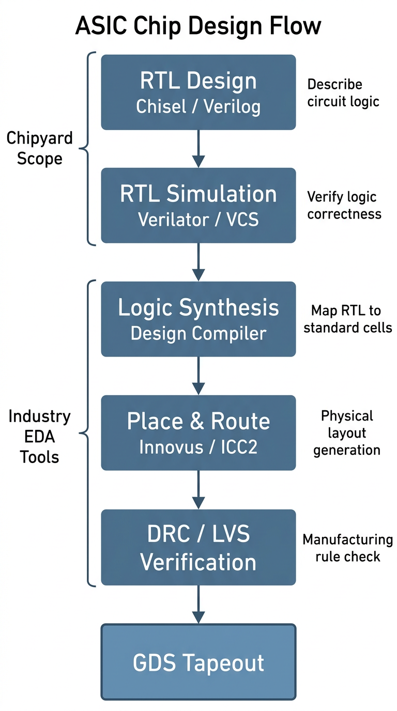
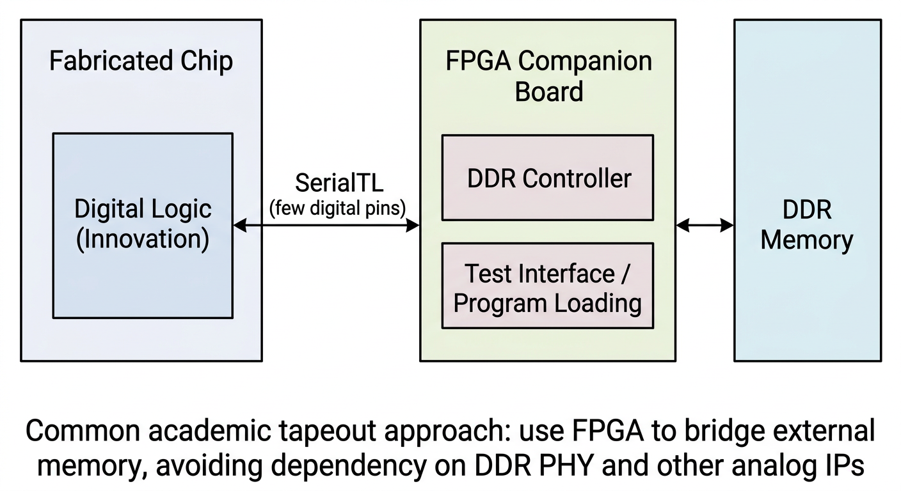

# Chapter 3: The Tapeout Perspective -- Where Chipyard Fits in a Real Chip Design Flow

In the first two chapters, we stayed entirely at the simulation level -- compiling RISC-V programs and running them on a software-modeled processor built with Verilator. But for those of us doing chip research, simulation is just a means to an end. The ultimate goal is to tapeout the design and verify it on real silicon.

This chapter is not a step-by-step how-to. Instead, it draws a "map": where Chipyard sits in the overall chip design flow, what portion of the flow it owns, how its outputs connect to industry-standard backend tools, and what kinds of engineering constraints you typically run into during an academic tapeout.

---

## 1. The Full Path from Design to Tapeout

A digital chip goes through roughly the following stages from design to final tapeout:

Let's walk through what each stage does.

**RTL design** is the starting point of the entire flow. RTL (Register Transfer Level) is an abstraction layer that describes the logical behavior of digital circuits -- when you write in Verilog or Chisel that "this module takes these inputs, produces these outputs, and its internal registers change in this way," you are doing RTL design. This step captures the *logic* of the circuit without touching physical implementation.

**RTL simulation and verification** confirms at the software level that the logic design is correct. Before tapeout, you must thoroughly verify that the RTL behaves as expected. What we did with Verilator in the previous two chapters is exactly this step; in industry, VCS is the more common tool.

**Synthesis** is the first major "leap" in the flow -- it translates the abstract RTL description into a netlist composed of real standard cells (AND gates, OR gates, flip-flops, and other basic logic elements). This step is performed by tools like Design Compiler (DC) and requires a process technology library, because different technology nodes have different standard cells. The result of synthesis is a list of "which gates to use and how to connect them," but at this point there is no physical placement information.

**Place and route** transforms the synthesized netlist into an actual chip layout: first, all standard cells are placed onto the chip area (placement), then metal wires connect them together (routing). This step is performed by tools like Innovus or ICC2, and the output is a layout with precise physical coordinates and routing.

**DRC / LVS verification** is the final gate before tapeout. DRC (Design Rule Check) confirms that all line widths, spacings, via dimensions, and other parameters in the layout meet the foundry's manufacturing requirements. LVS (Layout vs. Schematic) confirms that the physical layout's connectivity matches the synthesized netlist exactly. Both must pass before you can submit the GDS file for tapeout.

**GDS** (GDSII format) is the final file format for the chip layout. It contains graphical data for all layers; the foundry uses it to fabricate photomasks and begin the lithography process.

The entire pipeline can be understood in two halves: the first two steps (RTL design + simulation/verification) focus on *logical correctness* and are the main battlefield for a designer's creative work; the later steps (synthesis, place and route, verification) focus on *physical realizability* and rely more on tools and engineering experience. Chipyard is responsible for the first half.

For researchers working in digital design, innovations are mostly concentrated at the RTL level -- new processor microarchitectures, accelerator designs, interconnect structures, etc. -- and are ultimately expressed as RTL. Of course, there is another class of research where the innovation lies in designing a custom hard macro, such as a compute-in-memory array or an analog circuit block, and RTL is just the wrapper that instantiates it. In either case, the steps after synthesis are largely engineering execution problems, driven by tools and experienced engineers. Chipyard's value is in making the path from "digital design to tapeout-ready RTL" smooth enough that researchers can focus their energy on real innovation rather than on building infrastructure.

---

## 2. Why Chipyard's RTL Can Plug Directly into an Industrial Backend

You might wonder: Chisel is a relatively new hardware description language -- do industrial EDA tools even recognize it?

The answer is: industrial tools don't need to recognize Chisel, because the final output of Chisel compilation is standard Verilog. This means that as long as the generated Verilog is correct, the downstream synthesis and place and route flow is identical to hand-written Verilog from the tools' perspective. DC and Innovus see an ordinary Verilog design; they don't know, and don't need to know, how that Verilog was generated.

Chipyard also handles another important detail: special structures like SRAMs, clock gating cells (ICGs), and IO pads correspond to different physical macros under different process technologies and cannot be described with generic RTL. When generating Verilog, Chipyard automatically turns these structures into **blackboxes** -- only the interface is preserved, with an empty interior. During synthesis, the backend engineer simply replaces each blackbox with the real macro from the target technology. This design allows Chipyard-generated RTL to adapt to different technology nodes without modifying any source code.

---

## 3. Chipyard's Role in a Real Tapeout: A First-Hand Example

Let me walk through an academic tapeout I participated in to show how Chipyard is actually used in practice.

**Step 1: Write a Config for ASIC requirements and export Verilog.**

Resources in academic tapeout are extremely limited, and pad count is a key constraint. The more chip pins you have, the larger the pad ring, and the higher the cost. The default Chipyard configuration includes an AXI4 DDR interface, which requires hundreds of pins -- prohibitively expensive for tapeout.

Chipyard's Config mechanism proves its worth here: by modifying Config parameters -- without touching any RTL source code -- you can replace the external memory interface with SerialTL, an extremely compact serial interface with only a handful of signal lines. This change is done entirely at the Scala configuration level; not a single line of the underlying Rocket Core, bus, or cache RTL is modified.

Once the Config is ready, a single command generates synthesis-ready Verilog with SRAM blackboxes and IO pad placeholders, along with the corresponding simulation file package.

**Step 2: Pre-synthesis simulation with VCS.**

After exporting Verilog, run pre-synthesis simulation on VCS first to confirm functional correctness. The previous two chapters used Verilator; when interfacing with a tapeout flow, you typically switch to VCS -- it is the industry-standard simulator, is more consistent with the downstream synthesis environment, and makes it easier to debug discrepancies between simulation and synthesis results.

**Step 3: Replace blackboxes and run DC synthesis.**

Replace the SRAM blackboxes and ICG placeholders in the Verilog with macros from the foundry-provided technology library, add behavioral models for IO pads and analog blocks, apply constraint scripts, and hand everything to Design Compiler for synthesis. From this step onward, Chipyard's job is done -- the flow is entirely standard industrial ASIC digital backend.

**A note on Hammer**: Chipyard includes the Hammer framework, which aims to automate the backend steps described above. In practice, however, industrial EDA tools have varying invocation interfaces and complex license management, and Hammer's adaptation scripts require careful tuning for specific tool versions. For teams that already have a mature set of backend scripts, reusing the existing flow is often the better choice -- Chipyard just delivers clean Verilog, and the backend stays untouched. Hammer is better suited for scenarios where you are building a backend flow from scratch.

---

## 4. A Typical Challenge in Academic Tapeout: No Access to Analog IP

Commercial chips use a large amount of analog IP: DDR PHYs, SerDes, PLLs, IO drivers, and so on. These IPs typically require licensing agreements with the foundry or IP vendor, which academic tapeouts often cannot obtain.

The solution is FPGA bridging: the chip side retains only a simple digital interface, and an FPGA handles the DDR controller, external memory, and even test stimulus generation. The chip interacts with the FPGA through this digital interface, effectively offloading analog IO functions.

This is exactly the typical use case for the SerialTL interface. Chipyard's SerialTL can be thought of as a "host protocol": the FPGA runs a TSI server that handles memory reads/writes and program loading; the chip side sends requests over SerialTL, accessing DDR on the FPGA side as if it were local memory. The entire scheme is already implemented in Chipyard's FPGA support -- no additional development is needed.

Post-tapeout testing is considerably more complex, but that is beyond the scope of this series for now. If the opportunity arises, I may write a dedicated tapeout column to cover it in detail.

---

## 5. Summary

Chipyard's position in the overall chip design pipeline should now be fairly clear: it handles the front end -- RTL generation and simulation/verification -- and outputs standard Verilog that plugs seamlessly into an industrial backend. Through the blackbox mechanism, it provides clean replacement interfaces for SRAMs, ICGs, and IO pads. Through the Config mechanism, it lets you tailor interfaces and adjust parameters without ever touching RTL source code.

With this "map" in mind, you can see where every task you perform fits within the full tapeout pipeline -- whether you are tweaking a Config parameter or running a simulation, the purpose behind it becomes much clearer.

Next up: **Chapter 4 -- Booting Linux on an FPGA: A Chipyard Field Report**. We will get Linux actually running -- not just inside a simulator, but on an FPGA.
