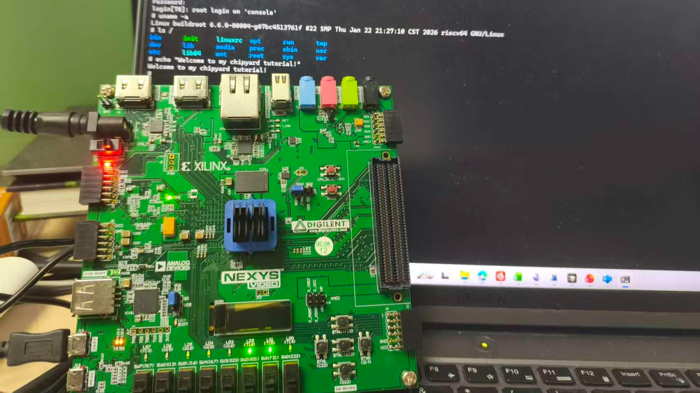
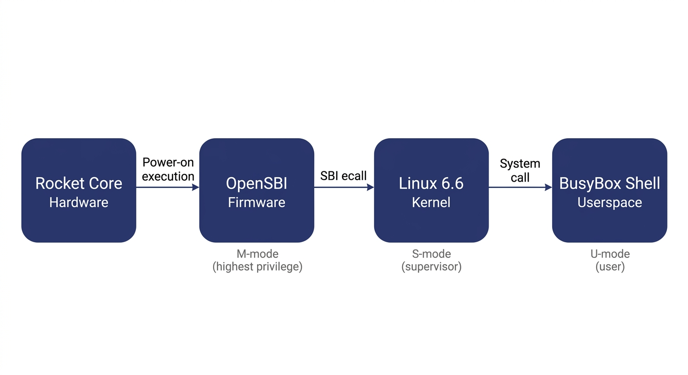
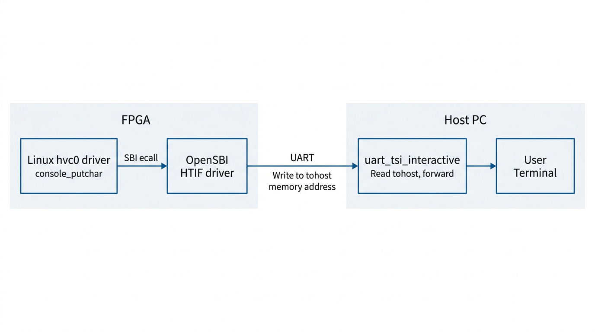

# Chapter 4: Booting Linux on an FPGA -- A Field Guide (Theory)

Enough preamble -- here is the end result:

An FPGA development board running a Rocket Core generated by Chipyard -- the same processor we simulated in the previous chapters -- displaying a Linux login prompt and accepting commands.

In the earlier chapters we stayed entirely within the simulation layer. Starting from this chapter, the goal levels up: get Linux running on a real FPGA board.

Before we get our hands dirty, though, let's first understand *how Linux actually boots*. Without that knowledge, when something breaks you won't know which layer to blame, which log to check, or why a particular configuration is necessary. This chapter covers the theory; the next one covers the hands-on practice.

---

## 1. The Big Picture: Two Independent Tasks

Running Linux on an FPGA is essentially two independent tasks.

**Hardware side**: Use Vivado to synthesize the Verilog generated by Chipyard into a bitstream and program it into the FPGA. An FPGA is fundamentally a programmable logic device -- a blank canvas out of the box. The bitstream is the circuit configuration written onto that canvas. Once programmed, the FPGA becomes a real RISC-V processor board running a Rocket Core, with real DDR memory, a real clock, and real I/O.

**Software side**: Build the software stack (OpenSBI + Linux kernel + root filesystem) on the host machine, package it into an ELF file, and transfer it to the FPGA's DDR over a UART serial link. ELF is an executable file format that contains the program's machine code along with load-address information; the host-side tool writes each segment into the correct DDR location.

The two tasks are independent and can be debugged separately -- once the bitstream is programmed, you don't need to touch it again. If the software has a problem, just fix it and reload; no re-synthesis required. This is a very practical aspect of Chipyard's prototyping workflow: synthesizing a bitstream typically takes tens of minutes, whereas reloading software takes only a few minutes.

---

## 2. The Software Stack: Four Layers

Booting Linux on RISC-V involves four layers:

Before explaining each layer, let's clarify the concept of *privilege levels* -- it is the key to understanding the entire stack.

Modern processors implement a privilege hierarchy to provide isolation and protection. Software running at a lower privilege level cannot freely access hardware registers or read/write another program's memory -- any attempt to do so triggers a processor exception. RISC-V defines three privilege levels: M-mode (Machine mode, the highest privilege, with access to everything), S-mode (Supervisor mode, mid-level privilege, where the operating system runs), and U-mode (User mode, the lowest privilege, where ordinary applications run). Each software layer can only invoke services from the layer below it through well-defined interfaces; it cannot bypass layers and manipulate hardware directly.

**OpenSBI** runs in M-mode. It is the most privileged software layer in the entire system and the very first code to execute after power-on. It has two responsibilities: first, it performs the lowest-level hardware initialization (e.g., configuring the interrupt controller and setting up memory protection); second, it exposes the SBI (Supervisor Binary Interface) to the layer above (Linux) -- a standardized set of service calls that Linux can invoke via the `ecall` instruction, such as printing a character, setting a timer, or bringing a core online. SBI is analogous to the abstraction layer that BIOS/UEFI provides to the OS in the x86 world. It is worth noting that OpenSBI is not the only way to boot Linux on RISC-V -- other SBI implementations like RustSBI exist, and there are also SBI-independent boot paths such as LinuxBoot and UEFI. We use OpenSBI here because Chipyard integrates it by default, making it ready to use out of the box.

**The Linux kernel** runs in S-mode and is the operating system we all know. In theory, Linux could drive UART hardware directly through a standard UART driver. However, in our configuration the UART hardware is occupied by the UART-TSI protocol (used for program loading and HTIF communication) and is not exposed to Linux. Therefore, the Linux console must go through the SBI-provided console interface, and the driver must be configured as `hvc0` (the SBI virtual console) rather than the usual `ttyS0` (which talks directly to UART hardware). This is a common pitfall for first-time users, and the hands-on chapter will address it in detail.

**The root filesystem** is the filesystem Linux mounts after booting. It contains the shell, basic commands (ls, cat, etc.), and library files. We use Buildroot to construct it -- Buildroot is an embedded Linux build framework that can cross-compile a complete, minimal rootfs. The resulting root filesystem is packaged as an initramfs (a compressed filesystem embedded inside the kernel image). At boot, Linux decompresses it into memory, runs `/init`, and ultimately drops into a BusyBox shell. BusyBox is a tool that bundles hundreds of common utilities -- ls, cat, sh, and more -- into a single executable, purpose-built for embedded scenarios with an extremely small footprint.

What actually gets loaded is a file called `fw_payload.elf` -- during OpenSBI's build, the Linux kernel is embedded directly inside it. The host only needs to transfer this single file. The processor starts executing at the OpenSBI entry point, and after initialization, OpenSBI automatically jumps to the kernel.

---

## 3. The Boot Process: How the Processor Wakes Up

Now that we understand the structure of the software stack, let's trace how the entire boot process is triggered.

After the FPGA is powered on and the bitstream is programmed via JTAG, the Rocket Core does not immediately run our program. Instead, it begins executing from the on-chip Boot ROM. The Boot ROM resides at address `0x1000_0000` and contains just a few dozen lines of assembly: it reads the current hart ID (the processor core number), loads the address of the DTB (Device Tree Blob -- a data structure describing what hardware is on the board and at what addresses) into a register, and then executes the **WFI (Wait For Interrupt)** instruction. WFI puts the processor into a low-power wait state -- literally "wait for interrupt." The processor sits there doing nothing until an interrupt arrives.

At this point the host takes over: the tool program opens the UART serial port, parses `fw_payload.elf`, and writes each loadable segment block-by-block into the FPGA's DDR at the specified addresses (via the UART-TSI protocol, which essentially lets the host remotely read and write the FPGA's memory). Once the transfer is complete, the tool writes a 1 to the MSIP register of the CLINT (Core Local Interruptor, the on-chip interrupt controller), triggering a software interrupt.

The Rocket Core detects the interrupt, wakes from WFI, and jumps to the DDR base address `0x8000_0000` -- the OpenSBI entry point. OpenSBI initializes the M-mode environment, sets up interrupt delegation (handing most exceptions and interrupts off to S-mode for handling), and then switches to S-mode via the `mret` instruction, jumping to the kernel entry point at `0x8020_0000`. Linux takes over, initializes memory management and various drivers, decompresses the initramfs, runs init, and finally prints the login prompt on the terminal.

There is an elegant design choice in this process: after power-on, the processor voluntarily pauses and waits, letting the host decide when to load a program, what program to load, and where execution should begin. This is the standard mode for FPGA prototyping -- you can swap in a different program at any time without re-programming the bitstream; just press CPU_RESET and it restarts.

---

## 4. How the Console Output Reaches Your Screen

There is one more piece of the puzzle to understand: how does a character output by `printf` inside Linux end up appearing on your host terminal?

Between the processor on the FPGA and the host, there is only a single UART wire. But UART is a very simple serial protocol -- it can only carry a byte stream, with no addressing and no commands. To allow the host to both read/write the FPGA's memory (for program loading) and relay console I/O, Chipyard runs a protocol called **TSI (Tethered Serial Interface)** over this wire. The host sends TSI commands like "write value Y to address X," and the hardware on the FPGA side parses the command and performs the corresponding memory operation.

Console output, however, uses a different mechanism: **HTIF (Host-Target Interface)**. When Linux outputs a character, it travels through the hvc0 driver -> SBI ecall -> OpenSBI. OpenSBI then writes the character to a specific memory-mapped address called `tohost`. The host-side tool continuously polls this address; when it reads data, it prints it to the terminal. In the reverse direction, when the user presses a key on the host, the tool writes the character to the `fromhost` address. OpenSBI reads it and returns it to Linux via SBI getchar.

The entire console I/O path operates purely through memory -- it does not depend on any additional hardware peripherals. This is also why the host-side tool must remain running for the entire duration of program execution -- it serves as the relay hub for the entire I/O path. If it exits, you lose all visibility.

---

## 5. Summary

Stringing these layers together, the logic of the entire boot process becomes clear:

FPGA power-on -> Program bitstream via JTAG -> Boot ROM WFI wait -> Host writes fw_payload.elf via TSI -> Software interrupt wakes the processor -> OpenSBI (M-mode) initializes -> Linux (S-mode) boots -> BusyBox Shell (U-mode) ready -> Console I/O relayed between memory and host via HTIF.

When something goes wrong, this chain serves as your troubleshooting map: no output at all? Check whether the host tool and TSI communication are working. Output appears but no interaction? Check whether the Linux console is configured to point to `hvc0`. Boot hangs midway? Check the kernel watchdog settings.

Next up: **Chapter 5 -- Booting Linux on an FPGA: A Field Guide (Practice)**, where we roll up our sleeves, walk through each layer end to end, and document every pitfall along the way.
