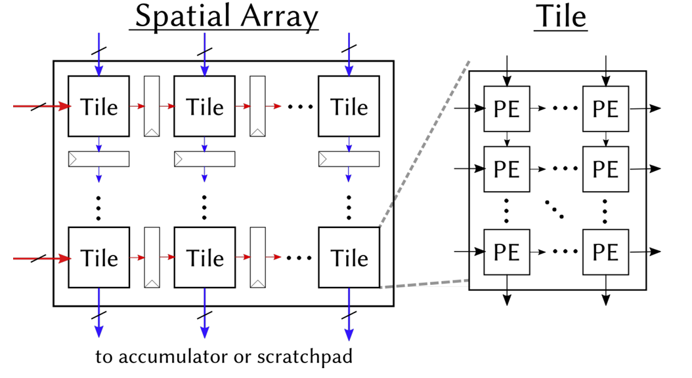
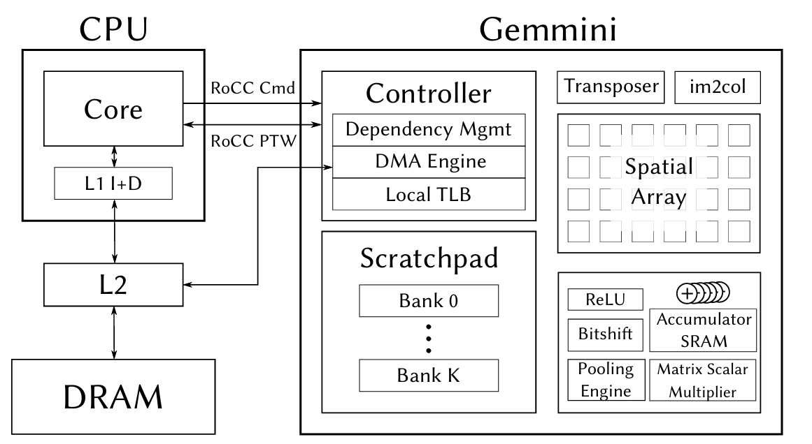
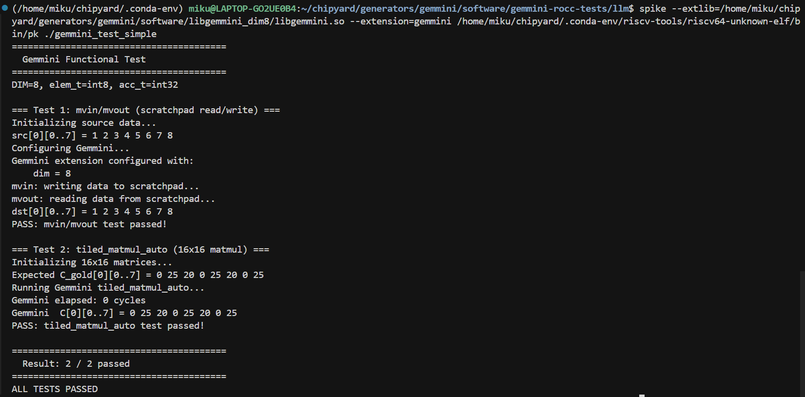

# Chapter 6: Gemmini -- Accelerating Matrix Operations with a Systolic Array

In the previous chapter, we got Linux running on the FPGA. Being able to run Linux means the software ecosystem is fully available -- compilers, runtimes, and user-space programs all work. But just being able to run general-purpose code isn't enough. When doing computer architecture research, a natural question arises: **What do you do when the general-purpose processor doesn't have enough compute power?**

The answer is to add a hardware accelerator.

This chapter introduces Chipyard's built-in matrix multiplication accelerator, **Gemmini** -- a configurable systolic array generator. We'll start from the working principles of a systolic array, then walk through how Gemmini connects to the Rocket Core, how to configure it on an FPGA, and how to write programs that invoke it. In the next chapter, we'll use Gemmini to run real LLM inference, using profiling to observe the accelerator's actual performance and limitations.

---

## 1. Why We Need a Matrix Multiplication Accelerator

Take neural network inference as an example. During the forward pass of a Transformer model, QKV projections, FFN layers, and the classifier are all matrix multiplications. For the TinyStories 15M model, generating a single token requires roughly 30 million multiply-accumulate (MAC) operations, over 95% of which are concentrated in matrix multiplications.

The Rocket Core we used in the previous chapter is a single-issue, in-order, five-stage pipeline running at a 50 MHz clock. A floating-point multiply-accumulate takes multiple cycles, so the number of MAC operations it can handle per second is on the order of millions. Running the matrix multiplications described above on it would take hundreds of milliseconds per token -- very inefficient.

Matrix multiplication is characterized by being **highly regular and massively parallel** -- the same set of weights is multiplied and accumulated with different input elements, with no complex dependencies between computations. This is exactly the kind of workload that specialized hardware can accelerate: arrange a large number of MAC units into an array, let data flow through in a fixed pattern, and complete dozens or even hundreds of multiply-accumulates simultaneously every clock cycle.

This is the basic idea behind a systolic array.

---

## 2. Systolic Array Principles

### 2.1 Basic Structure

A systolic array is a computational array composed of a large number of regularly arranged processing elements (PEs). Each PE can perform one multiply-accumulate operation, and PEs pass data to each other through fixed connections. The name "systolic" comes from an analogy to a heartbeat -- data flows like blood from one PE to the next every clock cycle, and the entire array works in lockstep.

The figure below shows the structure of Gemmini's systolic array. On the left is an overview of the Spatial Array: multiple Tiles are arranged in a grid, with input data flowing in from the left (red arrows) and from above (blue arrows), and computation results flowing out from the bottom to the Accumulator or Scratchpad. On the right, a single Tile is expanded to show its internal structure -- each Tile contains several PEs, which pass data along the same directions.



What each PE does internally is very simple:

```
c += a × b    // one multiply-accumulate (MAC)
```

It receives `a` from the left and `b` from above, performs a multiply-accumulate with the existing partial sum `c`, then passes `a` to the PE on the right and `b` to the PE below. In our 8x8 configuration, the array has 64 PEs, and can simultaneously perform 64 Int8 multiply-accumulates every clock cycle.

### 2.2 Weight Stationary Mode

Systolic arrays have multiple dataflow modes that determine which data "stays" in the PEs and which data "flows" through the array. Our Gemmini configuration uses **Weight Stationary (WS)** mode -- weights are preloaded into the PEs and remain stationary, while input data and partial sums flow through the array.

Taking the computation `C = A x B` as an example (A is the input, B is the weights):

**Step 1: Load weights.** Distribute the elements of weight matrix B to each PE. PE(i,j) stores B[i][j]. Once loading is complete, the weights "reside" in the array and no longer move.

**Step 2: Stream in inputs.** Each row of input matrix A flows into the array from the left. Elements of row k of A enter the PEs in row k, advancing one column per clock cycle.

**Step 3: Accumulate.** Each PE performs one multiply-accumulate per cycle: it multiplies its stored weight by the incoming input value and adds the result to the partial sum. After K cycles (where K is the inner product dimension), the partial sum in each PE is the corresponding element of the output matrix C.

**Step 4: Read out results.** Read the completed output matrix from the bottom of the array (or from the accumulator).

The advantage of WS mode is that weights only need to be loaded once and can be reused many times. This is well-suited for inference scenarios -- the same set of model weights is used repeatedly with different inputs.

### 2.3 Tiling: Handling Matrices Larger Than the Array

An 8x8 array can only directly compute an 8x8 matrix multiplication. Real-world matrices are often much larger (e.g., 288x768), so what do we do?

The answer is **tiling**: slice the large matrix into many 8x8 blocks (tiles), feed them into the array one by one, and assemble the results at the end. For example, a 288x768 matrix multiplication is split into `(288/8) x (768/8) = 36 x 96 = 3456` tiles for computation.

Gemmini's `tiled_matmul_auto` API handles tiling automatically -- you only need to pass in the matrix dimensions and pointers, and the tiling strategy is determined automatically by the hardware and runtime library. This is transparent to the application layer.

### 2.4 Local Storage: Scratchpad and Accumulator

Fetching data from main memory for every computation is too slow. Gemmini has two internal local storage areas to cache frequently accessed data:

- **Scratchpad**: Stores input matrix and weight data in int8 format. In our configuration: 32 KB (4 banks x 1024 rows x 8 bytes/row).
- **Accumulator**: Stores intermediate multiply-accumulate results (int32 partial sums). In our configuration: 16 KB (512 rows x 8 x 4 bytes/row).

The data flow is: Main memory -> DMA -> Scratchpad -> Systolic array -> Accumulator -> DMA -> Main memory. The DMA engine handles data transfers between main memory and local storage, and can be pipelined in parallel with computation.

---

## 3. Gemmini's Architecture Within Chipyard

### 3.1 The RoCC Interface

Gemmini connects to the Rocket Core through the **RoCC (Rocket Custom Coprocessor)** interface. The design philosophy of RoCC is straightforward: when the CPU encounters a custom instruction, it forwards the opcode and operands through a dedicated interface to an attached coprocessor, which executes the operation and writes the result back.

From the CPU's perspective, calling Gemmini is simply executing a custom instruction. This instruction is recognized by the Rocket Core's decoder as a RoCC instruction and forwarded to the Gemmini controller, triggering a series of operations including DMA transfers and systolic array computation. The CPU can continue executing subsequent instructions, or it can use a `fence` instruction to wait for Gemmini to finish.

On the software side, Gemmini provides a C header file (`gemmini.h`) that wraps RoCC instructions into C function calls. The most commonly used one is `tiled_matmul_auto` -- you pass in matrix dimensions, data pointers, and configuration parameters, and the underlying layer automatically handles tiling, DMA transfers, and array scheduling.

**RoCC is not just Gemmini's interface -- it is the universal attachment mechanism for all custom accelerators in Chipyard.** Once you've learned to walk through the "write Config -> synthesize Bitstream -> configure permissions -> invoke from user space" pathway with Gemmini, the process is exactly the same for other accelerators (e.g., a custom CNN accelerator, a cryptographic engine, or a signal processing unit). Only the accelerator's internal computation logic and software API change; the RoCC interface, permission configuration, and deployment process remain identical.

### 3.2 Full System Architecture

The figure below shows the complete architecture of the CPU and Gemmini connected via the RoCC interface. On the left is the Rocket Core (CPU), which sends instructions via RoCC Cmd and shares page tables via RoCC PTW. On the right is Gemmini's internal structure -- the Controller handles instruction parsing and dependency management, the DMA Engine transfers data between main memory and local storage, the Spatial Array (systolic array) performs matrix multiplication, and the Scratchpad and Accumulator provide on-chip caching.



The figure also shows some Gemmini modules that we didn't use this time -- the Transposer (matrix transposition), im2col (convolution unrolling), Pooling Engine, etc. These are designed for CNN inference scenarios. We disabled them in the Config via `has_training_convs = false` and `has_max_pool = false` to save FPGA resources.

---

## 4. Hardware Configuration: Generating a Bitstream with Gemmini

### 4.1 Chipyard Config

The previous chapter used `RocketNexysVideoFastUARTConfig`, which only includes the Rocket Core. To add Gemmini, we need to write a new Config. The approach is to add two classes in `fpga/src/main/scala/nexysvideo/Configs.scala`:

The first is `WithSmallGemmini`, which defines Gemmini's hardware parameters:

```scala
class WithSmallGemmini extends Config((site, here, up) => {
  case BuildRoCC => up(BuildRoCC) ++ Seq(
    (p: Parameters) => {
      implicit val q = p
      val gemmini = LazyModule(new Gemmini(GemminiConfigs.defaultConfig.copy(
        meshRows = 8,                          // 8×8 array (default is 16×16)
        meshColumns = 8,
        sp_capacity = CapacityInKilobytes(32),  // Scratchpad 32KB
        acc_capacity = CapacityInKilobytes(16), // Accumulator 16KB
        has_training_convs = false,             // Disable training convolutions to save resources
        has_max_pool = false,                   // Disable pooling
        dataflow = Dataflow.WS,                 // Weight Stationary
        ld_queue_length = 4,                    // Reduced queue depth
        st_queue_length = 2,
        ex_queue_length = 4,
        acc_read_full_width = false,
        ex_read_from_acc = false,
        ex_write_to_spad = false
      )))
      gemmini
    }
  )
})
```

Why 8x8 instead of the default 16x16? Because the Artix-7 doesn't have enough BRAM. Gemmini's Scratchpad and Accumulator are entirely implemented using BRAM. A 16x16 array with the default 256 KB Scratchpad would require far more BRAM than the Nexys Video's 365 Block RAMs. Shrinking to 8x8 + 32 KB/16 KB brings BRAM utilization to roughly 96% -- just barely fitting.

The second is the top-level Config, which combines Gemmini, board-level configuration, and the Rocket Core:

```scala
class GemminiNexysVideoConfig extends Config(
  new WithSmallGemmini ++
  new WithNexysVideoTweaksFastUART ++
  new chipyard.config.WithBroadcastManager ++
  new chipyard.config.WithSystemBusWidth(128) ++ // Gemmini requires a 128-bit bus
  new chipyard.RocketConfig)
```

Note that `WithSystemBusWidth(128)` is required by Gemmini -- Gemmini's DMA needs a sufficiently wide bus to transfer data efficiently.

### 4.2 FPGA Resource Utilization

Post-synthesis resource utilization:

| Resource | Used | Available | Utilization |
|----------|------|-----------|-------------|
| LUT | ~80,000 | 134,600 | 59% |
| FF | ~50,000 | 269,200 | 19% |
| BRAM | 350 | 365 | **96%** |
| DSP | 48 | 740 | 6% |

BRAM is the only bottleneck -- nearly maxed out. LUT and FF have plenty of headroom, and DSP usage is minimal (Int8 multiplication doesn't require DSP slices). If your FPGA has more BRAM (e.g., the Virtex UltraScale+ on a VCU118), you can use a larger array and a bigger Scratchpad.

### 4.3 Synthesis and Programming

The process is the same as in the previous chapter, just with a different Config name:

```bash
cd ~/chipyard
source env.sh

# Generate Verilog (optional, for a quick sanity check of the configuration)
make -C fpga SUB_PROJECT=nexysvideo CONFIG=GemminiNexysVideoConfig verilog

# Synthesize Bitstream (requires Vivado, takes longer due to increased logic)
make -C fpga SUB_PROJECT=nexysvideo CONFIG=GemminiNexysVideoConfig bitstream
```

Synthesis takes considerably longer than with the bare Rocket Core (Gemmini adds a lot of logic) and may require one to two hours on a typical workstation. The programming step is exactly the same -- use Vivado Hardware Manager to flash the `.bit` file.

---

## 5. Software Prerequisites: Enabling User-Space Access to Gemmini

Gemmini is invoked via RoCC custom instructions. By default, RISC-V's privilege mechanism **prohibits user-space programs from executing custom instructions** -- this is for security. To allow user-space programs under Linux to call Gemmini, permissions need to be enabled at two levels.

### 5.1 OpenSBI: Setting mstatus.XS

The XS bits in the `mstatus` register control the state of custom extensions. If XS=0 (Off), any custom instruction will trigger an Illegal Instruction exception. We need to set XS to a nonzero value during OpenSBI initialization:

```c
// lib/sbi/sbi_hart.c - mstatus_init()
mstatus_val |= MSTATUS_XS;  // Enable custom extensions
csr_write(CSR_MSTATUS, mstatus_val);
```

This step is done in M-mode, before the Linux kernel boots.

### 5.2 Linux Kernel: Enabling CONFIG_RISCV_ROCC

The Linux kernel needs to set `sstatus.XS` to `Initial` (01) when creating new processes, allowing user-space access to RoCC:

```c
// arch/riscv/kernel/process.c - start_thread()
#ifdef CONFIG_RISCV_ROCC
    regs->status |= SR_XS_INITIAL;
#endif
```

Enable it in the kernel `.config`:

```
CONFIG_RISCV_ROCC=y
```

If either of these two steps is missing, user-space programs will receive `SIGILL` (Illegal Instruction) when executing Gemmini instructions. In `dmesg`, you can see that the `badaddr` corresponds to the RoCC instruction encoding.

---

## 6. Using Gemmini for Matrix Multiplication

### 6.1 Data Type: Int8

Our Gemmini configuration uses **Int8 data types** -- each PE in the systolic array performs `int8 x int8 -> int32` multiply-accumulates. This means both the input matrix and the weight matrix must be in int8 format. If the original data is float32 (e.g., neural network weights), it needs to be **quantized** to int8 before being fed into Gemmini. The specific quantization scheme and implementation will be covered in detail in the next chapter alongside a real application.

This section focuses on how to call Gemmini -- assuming you already have int8 data, how to make Gemmini compute a matrix multiplication.

### 6.2 The tiled_matmul_auto API

Gemmini's core API is `tiled_matmul_auto`, defined in `gemmini.h`. This function takes matrix dimensions and pointers, and automatically handles tiling, DMA transfers, and systolic array scheduling:

```c
tiled_matmul_auto(
    dim_I, dim_J, dim_K,    // Output I×J, inner product dimension K
    A, B,                    // Input matrices (int8)
    D, C,                    // Bias and output
    stride_A, stride_B, stride_D, stride_C,
    A_scale, B_scale, D_scale,
    activation,              // Activation function (NO_ACTIVATION / RELU)
    acc_scale,               // Accumulator scale factor
    bert_scale,
    repeating_bias,
    transpose_A, transpose_B,
    full_C, low_D,           // Output precision control
    weightA,
    WS                       // Dataflow mode: Weight Stationary
);
gemmini_fence();             // Wait for Gemmini to complete
```

There are many parameters, but most can be left at their defaults. The key ones are:

- `dim_I, dim_J, dim_K`: Matrix dimensions, C(IxJ) = A(IxK) x B(KxJ)
- `acc_scale`: Scale factor from the int32 accumulator to the output
- `WS`: Weight Stationary mode
- `gemmini_fence()`: Called after issuing the compute instruction; the CPU waits for Gemmini to finish

### 6.3 A Simple Example

Suppose we want to compute `C(d,1) = W(d,n) x x(n,1)` -- a weight matrix multiplied by an input vector, the most common operation in neural network inference:

```c
// W: d×n int8 weight matrix (already prepared)
// x: n×1 int8 input vector
// C: d×1 output

tiled_matmul_auto(
    d, 1, n,              // Output: d rows, 1 column; inner product dimension: n
    (elem_t*)W, x,        // Weights and input (both int8)
    NULL, C,              // No bias, output to C
    n, 1, 0, 1,           // Memory strides
    MVIN_SCALE_IDENTITY, MVIN_SCALE_IDENTITY, MVIN_SCALE_IDENTITY,
    NO_ACTIVATION,
    ACC_SCALE_IDENTITY,   // Accumulator scale factor
    0,
    false, false, false,
    false, false,         // full_C=false: output int8
    0, WS
);
gemmini_fence();
```

After this call, `C` contains the matrix multiplication result. From the programmer's perspective, the entire process is a single function call -- tiling, DMA, and array scheduling are all handled automatically.

### 6.4 A Real-World Pitfall: The full_C Parameter

`tiled_matmul_auto` has a `full_C` parameter that controls the output format:
- `full_C=true`: Output int32 (preserving the full precision of the accumulator)
- `full_C=false`: Output int8 (the accumulator result is multiplied by acc_scale and truncated to int8)

We initially used `full_C=true`, and the output was all zeros. After investigation, we found that `full_C=false` is what works correctly with our hardware configuration. These subtle differences in API parameters are often not documented in detail -- you only discover them by actually running the code.

---

## 7. Verifying That Gemmini Works

Before deploying an LLM, use a simple test program to verify that the Gemmini hardware is functioning correctly. Gemmini provides a test suite (`gemmini-rocc-tests`) that can run on either the simulator or the FPGA.

### 7.1 Spike Simulation Verification

Spike is the RISC-V instruction set simulator and supports the Gemmini extension. Note that the default libgemmini uses DIM=16; you need a DIM=8 version matching your hardware configuration:

```bash
spike --extlib=/path/to/libgemmini_dim8/libgemmini.so \
      --extension=gemmini \
      pk ./gemmini_test_simple
```

The test program verifies two things: Scratchpad mvin/mvout data movement, and a 16x16 matrix multiplication via `tiled_matmul_auto` (larger than the array size, requiring tiling). Both tests pass, confirming that the Gemmini instructions and tiling logic are correct.

<!-- TODO: Insert Spike verification screenshot spike_gemmini_test.png -->


### 7.2 Verification on FPGA

Run the same test program on the FPGA to confirm that the hardware implementation behaves consistently with the simulation. The deployment path is essentially the same as in previous chapters -- compile the RISC-V program and load it onto the FPGA via UART-TSI.

Bare-metal programs can be loaded directly via `uart_tsi`. However, if you want to run test programs under Linux, there is one thing to keep in mind: **after UART-TSI finishes loading `fw_payload.elf`, it becomes an interactive console and can no longer be used to transfer files.** Therefore, programs and data files to be run under Linux need to be prepared in advance. There are two approaches:

1. **Bundle into initramfs**: When building `fw_payload.elf`, include the test programs in the root filesystem's cpio archive. The downside is that you need to recompile the kernel and firmware every time you change a file.
2. **Use an SD card**: Add an SPI peripheral in the Config (e.g., `GemminiNexysVideoSDConfig`), and mount the SD card in Linux to read files. Changing files only requires removing the card and copying to it -- no firmware rebuild needed.

The SD card approach is more convenient. It's tangential to the main topic, so feel free to explore it on your own. The companion repo's `Configs.scala` includes a ready-made `GemminiNexysVideoSDConfig` for reference.

Once verification passes, you can start building real applications on this foundation.

---

## 8. Summary

Let's recap what this chapter covered:

1. **Systolic array principles**: PE array structure, Weight Stationary dataflow, tiling for large matrices
2. **Gemmini architecture**: Connected to the Rocket Core via the RoCC interface, with built-in Scratchpad and Accumulator
3. **Hardware configuration**: Writing a Chipyard Config with an 8x8 array + 32 KB/16 KB local storage, just barely fitting into the Artix-7
4. **Software permissions**: Setting `mstatus.XS` in OpenSBI, enabling `CONFIG_RISCV_ROCC` in Linux
5. **Calling Gemmini**: The `tiled_matmul_auto` API -- just pass in matrix dimensions and int8 data

At this point, the hardware and software foundations are in place -- Gemmini can correctly execute matrix multiplication on the FPGA, and we understand how to use the API.

The Gemmini Config, OpenSBI patch, and Linux RoCC configuration discussed in this article are all in the companion repository:

> GitHub: https://github.com/mikutyan4/chipyard-linux-nexys

Next chapter: **Chapter 7 -- Running LLM Inference on FPGA with Gemmini**. We'll apply Gemmini to real LLM inference -- how to quantize a float32 model to int8, how to deploy it to the FPGA, how much speedup the accelerator delivers in practice, and why a 75x improvement in matrix multiplication translates to only a 10x overall speedup.

---
