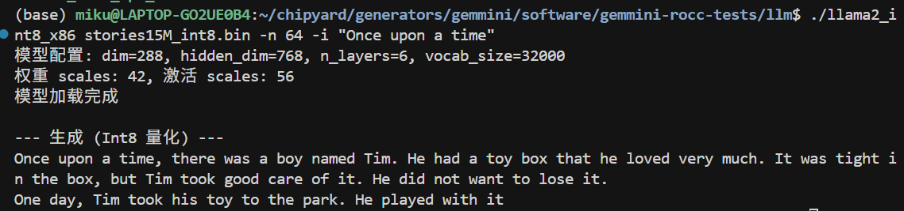

# Chapter 7: Running LLM Inference on FPGA with Gemmini

The previous chapter covered Gemmini's architecture and how to invoke it. This chapter puts it to real use — **accelerating LLM inference on FPGA with Gemmini** — and then uses profiling to observe the accelerator's actual impact.

The model used is the TinyStories 15M that ships with Andrej Karpathy's [llama2.c](https://github.com/karpathy/llama2.c) — a scaled-down LLaMA 2 architecture with 6 Transformer layers and roughly 15 million parameters. Small as it is, the Transformer computation structure is complete, making it a clear window into how the accelerator performs under a real workload.

---

## 1. Overall Strategy: Which Operations Go to Gemmini

Not everything in a Transformer forward pass is matrix multiplication. Breaking it down layer by layer:

| Operation | Computation Type | Gemmini-Compatible |
|-----------|-----------------|---------------------|
| QKV Projection | Matrix multiplication | **Yes** |
| RoPE Positional Encoding | Trigonometric functions | No |
| Attention (QK^T + Softmax) | Sparse operations | No |
| Output Projection | Matrix multiplication | **Yes** |
| RMSNorm | Element-wise operations | No |
| FFN (W1, W3) | Matrix multiplication | **Yes** |
| SiLU Activation | Element-wise nonlinearity | No |
| FFN (W2) | Matrix multiplication | **Yes** |
| Classifier | Matrix multiplication | **Yes** |

Each layer has 7 matrix multiplications (wq, wk, wv, wo, w1, w2, w3), plus the final Classifier — all of these go to Gemmini. The remaining operations — RMSNorm, RoPE, Attention, SiLU, etc. — stay on the CPU and run in float32.

---

## 2. Int8 Quantization

### 2.1 Why Quantize

As mentioned in the previous chapter, our Gemmini is configured for the Int8 data type — the PEs perform `int8 × int8 → int32`. But the model weights are float32, so they must be quantized before Gemmini can process them.

The core idea of quantization is mapping the continuous float32 values to the 256 discrete values of int8 (-128 to 127). The mapping strategy determines how much precision is lost.

### 2.2 Approach: Per-Tensor Symmetric Quantization

We use the simplest approach — **per-tensor symmetric quantization**:

```
scale = max(|tensor|) / 127
quantized = round(tensor / scale)
```

Take the maximum absolute value across the entire tensor and linearly map it to ±127. Each tensor requires only a single scale value.

### 2.3 Weight Quantization (Offline)

Weights are fixed before inference, so we quantize them ahead of time with a Python script:

```python
def quantize_tensor(tensor):
    scale = np.max(np.abs(tensor)) / 127
    quantized = np.round(tensor / scale).clip(-128, 127).astype(np.int8)
    return quantized, scale
```

For each layer, the 7 weight matrices get their own scale and are converted to int8. Token embedding and RMSNorm weights remain in float32 (they are not involved in matrix multiplications).

### 2.4 Activation Quantization (Static Calibration)

Activations are produced dynamically during inference. We run a float32 inference pass over 5 sample sequences, record the maximum absolute value at each activation point in every layer, and multiply by a 1.2x margin to obtain the scale:

```python
calibration_tokens = [
    [1, 450, 2501, 263, 931],   # "Once upon a time"
    [1, 13, 851, 338, 263],     # "There was a"
    ...
]
```

This way, all scales are known constants at inference time — no runtime dynamic computation is needed.

### 2.5 Verification

After quantization, we first verify on x86:

```bash
./llama2_int8_x86 stories15M_int8.bin -n 64 -i "Once upon a time"
```



(The prompt messages in the screenshot are in Chinese; the version in the companion repo has been translated to English.)

The output on x86 is largely coherent, but a careful look reveals occasional unnatural expressions — this is the precision loss from int8 quantization. The per-tensor symmetric quantization we use is the simplest scheme: the entire tensor shares one scale, and if the weight distribution is uneven (some channels have a large range while others are tiny), many small values get quantized to 0, losing information. On the FPGA there is an additional int32→int8 intermediate truncation step, causing errors to accumulate further.

Common improvements used in industry include: **per-channel quantization** (computing a separate scale for each output channel, significantly improving precision), **SmoothQuant** (rebalancing the quantization difficulty between weights and activations through mathematically equivalent transformations), and **GPTQ/AWQ** (weight optimization methods that minimize quantization error using calibration data). The core idea behind all of these techniques is to make more precise use of int8's 256 discrete values to approximate the original float32 distribution. Interested readers can start with the SmoothQuant paper — the intuition is very straightforward.

Quantization precision optimization is an independent research direction in its own right and falls outside the scope of this tutorial. Here we use the simplest scheme to get the pipeline working end-to-end, and focus on the profiling and accelerator analysis that follow.

---

## 3. Gemmini-Accelerated matmul

With int8 data in hand, we can call Gemmini. The full matrix multiplication flow is:

```c
void matmul_gemmini(float* xout, float* x, int8_t* w, 
                    float w_scale, float x_scale, float out_scale,
                    int n, int d) {
    // 1. Quantize input: float32 → int8
    for (int i = 0; i < n; i++) {
        int32_t q = (int32_t)roundf(x[i] / x_scale);
        g_B[i] = clamp(q, -128, 127);
    }
    
    // 2. Compute acc_scale: controls scaling from int32 accumulator to int8 output
    float acc_scale = (w_scale * x_scale) / out_scale;
    
    // 3. Gemmini computation: C(d,1) = W(d,n) × x(n,1)
    tiled_matmul_auto(
        d, 1, n,
        (elem_t*)w, g_B,
        NULL, g_C,
        n, 1, 0, 1,
        MVIN_SCALE_IDENTITY, MVIN_SCALE_IDENTITY, MVIN_SCALE_IDENTITY,
        NO_ACTIVATION, acc_scale, 0,
        false, false, false,
        false, false,    // full_C=false: output int8
        0, WS
    );
    gemmini_fence();
    
    // 4. Dequantize output: int8 → float32
    for (int i = 0; i < d; i++) {
        xout[i] = (float)((int8_t)g_C[i]) * out_scale;
    }
}
```

**CPU quantizes the input → Gemmini performs the int8 matrix multiplication → CPU dequantizes the output.** The matrix multiplication itself is done in hardware; the CPU is only responsible for data format conversion on both ends.

---

## 4. Deploying to the FPGA

### 4.1 Compiling the LLM Program

Cross-compile with Chipyard's RISC-V toolchain, statically linked:

```bash
source ~/chipyard/env.sh
cd gemmini-llm
make CHIPYARD=~/chipyard llm llc
```

`llm` is the Gemmini-accelerated version; `llc` is the CPU-only version (used as a baseline). Both include profiling timers.

### 4.2 Packing initramfs

After Linux boots, UART-TSI becomes the interactive console and can no longer be used to transfer files. The LLM program and model must be packed into initramfs ahead of time:

```bash
cd /tmp && mkdir -p initramfs_llm && cd initramfs_llm

fakeroot sh -c "
  cpio -idm < ~/chipyard/software/firemarshal/images/prototype/br-base/initramfs.cpio 2>/dev/null
  mkdir -p root/llm
  cp /path/to/llm root/llm/
  cp /path/to/llc root/llm/
  cp /path/to/stories15M_int8_v2.bin root/llm/m2.bin
  cp /path/to/tokenizer.bin root/llm/t.bin
  chmod 755 root/llm/llm root/llm/llc
  chown -R root:root .
  find . | cpio -o -H newc > ~/initramfs_llm.cpio
"
```

Key point: you must use `fakeroot` to ensure file ownership is root:root, otherwise the kernel will Kernel Panic when parsing the cpio archive.

After packing, update the kernel's `CONFIG_INITRAMFS_SOURCE`, then recompile Linux and OpenSBI to generate a new `fw_payload.elf`.

Alternatively, you can use the SD card approach (`GemminiNexysVideoSDConfig`) — place the files on an SD card, mount and read them after Linux boots, and avoid recompiling the firmware each time.

### 4.3 Flashing and Booting

1. Flash the `GemminiNexysVideoConfig` bitstream with Vivado
2. Load `fw_payload.elf` via `uart_tsi_interactive` (921600 baud, ~12 minutes because the LLM model is included)
3. Log in to Linux (root / fpga)

---

## 5. Results

After logging in, navigate to the `/root/llm` directory. First, run the CPU version as a baseline:

```bash
./llc m2.bin -z t.bin -n 8 -t 0 -i "Once upon a time"
```

Then run the Gemmini-accelerated version:

```bash
./llm m2.bin -z t.bin -n 8 -t 0 -i "Once upon a time"
```

Both versions produce English stories. `-t 0` selects greedy mode (always pick the highest-probability token), yielding deterministic output for easier comparison.


---

## 6. Profiling-Driven Optimization

This section is the heart of the chapter — not a one-shot result, but an iterative cycle of **profiling → identifying the bottleneck → targeted optimization → profiling again**.

### 6.1 Round 1: Accelerating matmul, but Only a 1.52x Speedup

After replacing all QKV and FFN matrix multiplications with Gemmini calls, we ran the comparison test with high expectations:

| Version | Cycles (8 tokens) | Speedup |
|---------|-------------------|---------|
| CPU int8 | 1,633,777 | 1.00x |
| Gemmini int8 | 1,072,250 | **1.52x** |

Only 1.52x? Gemmini should be much faster on matrix multiplications. Where is the problem?

**Without profiling, you cannot know.**

### 6.2 Adding Profiling, Finding the Real Bottleneck

We inserted `rdtime` timing calls before and after each key operation, recompiled, and ran again. Profiling results:

```
--- Profiling (8 tokens) ---
Total cycles:          1,056,147

Classifier (CPU)         913,481   89.49%   ← !!
Sampling                  58,982    5.78%
Softmax                   14,566    1.43%
Other                     69,118    3.30%
```

**The Classifier consumed 89.5% of the time.**

The reason: the Classifier is a `vocab_size(32000) × dim(288)` matrix multiplication — a massive computation (18.4 million float operations). But it uses the token embedding weights, which had been kept in float32 without quantization, so it did not go through Gemmini and was computed on the CPU in float32.

All the other matrix multiplications (QKV, FFN, etc.) were already accelerated by Gemmini and ran fast. But the Classifier alone ate 89.5% of the total time.

### 6.3 Round 2: Handing the Classifier to Gemmini Too

The fix: quantize the token embedding to int8 as well and switch the Classifier to use Gemmini.

Specific changes:
1. `quantize.py` — add int8 quantization for the embedding and generate a new model file
2. `llama2_int8_gemmini.c` — change the Classifier to use `matmul_gemmini`

We first verified the quantized Classifier's precision on x86: logits correlation 0.997, top-5 tokens identical.

### 6.4 After Optimization: 10x Speedup

Profiling results after optimization:

| Metric | Before | After | Improvement |
|--------|--------|-------|-------------|
| **Total cycles** | 1,056,147 | 163,474 | **6.5x** |
| **Classifier** | 913,481 (89.5%) | 5,192 (5.3%) | **176x** |
| Cycles/token | 132,018 | 20,434 | **6.5x** |

Compared with the CPU baseline:

| Version | Cycles (8 tokens) | Speedup |
|---------|-------------------|---------|
| CPU int8 | 1,633,777 | 1.00x |
| Gemmini (initial) | 1,072,250 | 1.52x |
| Gemmini (optimized) | 163,474 | **10.0x** |

Speedup on the matrix multiplication portion alone: **75x**.

Final throughput: ~3 tok/s in greedy mode, ~2 tok/s in top-p mode.

### 6.5 The New Bottleneck After Optimization

With the Classifier no longer the bottleneck, the time distribution shifted to:

| Phase | Share | Description |
|-------|-------|-------------|
| forward() computation | 52% | Attention + SiLU + RoPE and other CPU operations |
| I/O (serial output) | 40% | Hardware limitation of 921600 baud |
| Sampling | 8% | top-p sorting |

The new bottleneck is no longer matrix multiplication, but CPU-side Attention computation, activation functions, and serial I/O. None of these can be accelerated by Gemmini.

---

## 7. Why 75x matmul Speedup Yields Only 10x Overall Speedup

This is a vivid illustration of **Amdahl's Law**.

If the original matrix multiplication accounts for p% of total time and is sped up by a factor of S, then the overall speedup is:

```
Overall speedup = 1 / ((1 - p) + p/S)
```

In our case, matrix multiplication accounts for roughly 87% (after optimizing the Classifier), and S = 75:

```
1 / ((1 - 0.87) + 0.87/75) = 1 / (0.13 + 0.012) = 7.0x
```

This is broadly consistent with the measured ~10x (the difference comes from cache effects and overhead variations).

**Key takeaway**: An accelerator can only speed up the portion it handles. Even with a 75x speedup on matrix multiplications, the remaining 13% of CPU operations sets the ceiling for overall speedup at roughly 7-8x. To push further, operations like Attention and SiLU would also need to be offloaded to hardware — which is exactly the design philosophy behind industrial AI accelerators (GPUs, TPUs, NPUs).

---

## 8. Performance Comparison and Discussion

### 8.1 Comparison with Other Platforms

| Platform | Model | Speed | Power |
|----------|-------|-------|-------|
| **This experiment (FPGA)** | 15M | ~3 tok/s | ~5W |
| Raspberry Pi 4 | 15M | ~10 tok/s | ~5W |
| Apple M1 | 7B | ~10 tok/s | ~15W |
| RTX 3080 | 7B | ~50 tok/s | ~300W |

In absolute performance the FPGA is not competitive — a 50MHz Rocket Core with an 8×8 systolic array simply cannot match mature CPUs/GPUs in raw compute. But that is not the point.

### 8.2 The Value of This Demo

The value of this experiment lies not in the performance numbers themselves, but in demonstrating the **complete closed loop from hardware accelerator design to application deployment**:

1. **Hardware layer**: Configure systolic array parameters in Chisel, synthesize to FPGA
2. **System layer**: OpenSBI and Linux kernel configuration for RoCC permissions
3. **Algorithm layer**: Int8 quantization scheme, precision-performance tradeoff
4. **Application layer**: Integrate quantization and Gemmini calls into LLM inference
5. **Analysis layer**: Profiling to locate bottlenecks, iterative optimization

This pipeline happens every day in industrial AI chip projects — just at a larger scale, with wider arrays, higher frequencies, and more complex software stacks. But the fundamental methodology is the same: hardware provides compute, software manages data flow, and profiling guides optimization.

### 8.3 Utilization Issues with the 8×8 Array

Current LLM inference generates one token at a time (Batch=1), so each matrix multiplication is a vector-matrix multiply (1×n @ n×d). Only 1 of the 8 rows in the 8×8 array is active, yielding a utilization of just 12.5%.

Ways to improve utilization:
- **Prefill phase**: When processing a long prompt, multiple tokens can be batched together
- **Larger models**: Larger matrix dimensions allow more effective tiling
- **Batched inference**: Processing multiple requests simultaneously

---

## 9. Summary

What this chapter accomplished:

1. **Quantization**: Per-tensor symmetric int8 quantization with offline weight quantization + static activation calibration
2. **Modifying llama2.c**: Connected 7 matrix multiplication layers + the Classifier to Gemmini
3. **Deployment**: initramfs packing, fw_payload.elf compilation, FPGA loading
4. **Profiling-driven optimization**: Discovered the Classifier was a 89.5% bottleneck → quantized the embedding → achieved 10x overall speedup
5. **Analysis**: Amdahl's Law explains why a 75x matmul speedup translates to only a 10x overall speedup

Profiling is a prerequisite for optimization — without measurement you cannot know where the bottleneck lies. Once the first bottleneck is resolved, the next one surfaces. This iterative process itself is the most important methodology in performance optimization.

Additionally, while this chapter uses an LLM as the demonstration, the same path applies to other models. If you want to run YOLO object detection, Diffusion-based image generation, or any other model that involves matrix multiplications, the workflow is the same: quantize model weights to int8, implement forward inference in C, hand off matrix multiplications to Gemmini via `tiled_matmul_auto`, and leave the remaining operations on the CPU. The only difference is model structure — convolutions can be unrolled into matrix multiplications (im2col), and the U-Net in Diffusion models is also full of matmuls. The core quantization, invocation, deployment, and profiling pipeline can be reused directly.

We recommend actively using AI coding tools such as Copilot, Claude Code, and Cursor for this kind of engineering work. Questions like "should Gemmini's `full_C` parameter be true or false" or "what to do when int8 quantization precision is insufficient" are extremely tedious to track down manually in tens of thousands of lines of code, but pasting the symptoms and code snippets into an AI assistant can help you narrow down the problem quickly.

The quantization scripts, LLM inference code, and Makefiles discussed in this chapter are all available in the companion repo:

> GitHub: https://github.com/mikutyan4/chipyard-linux-nexys

This is the final main chapter of the series. By reaching this point, you now have a configurable processor core, a customizable hardware accelerator, a complete Linux software stack running on an FPGA, and end-to-end experience deploying AI models on it and analyzing performance with profiling. As a researcher in the AI chip space, this essentially covers the foundational skills for research in the field — from here, whether you pursue accelerator microarchitecture optimization, quantization algorithm improvements, or dataflow design space exploration, you can work directly on this platform.

Some thoughts this series aims to convey — about reuse and about AI tools — are saved for the conclusion: **Conclusion — Standing on the Shoulders of Giants to Do Computer Architecture Research**.

---
