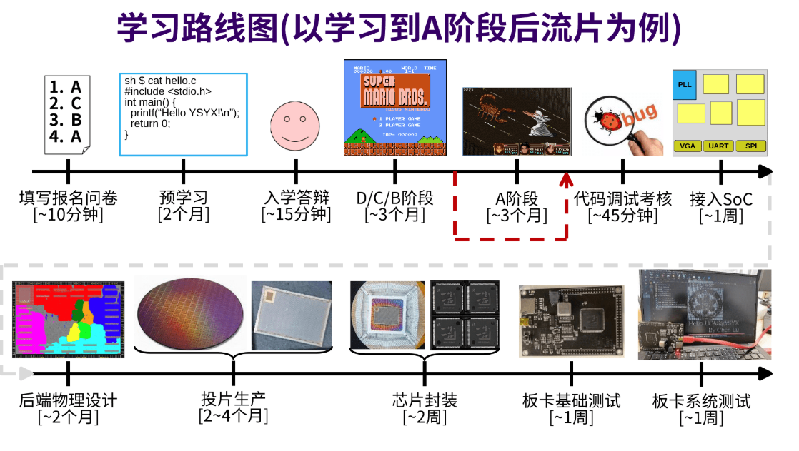
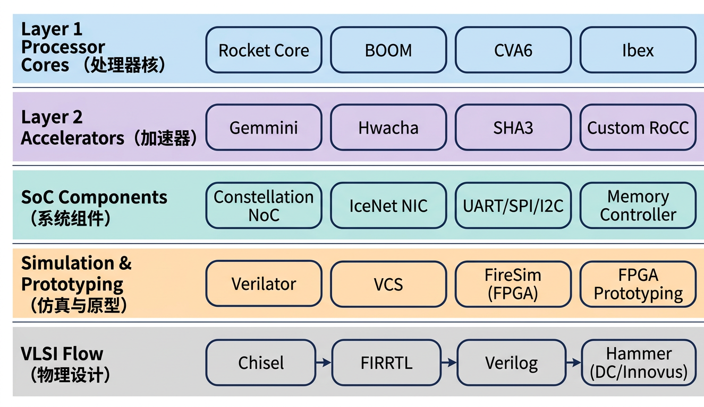

# Why Chipyard: A Shorter Path to Running the Full RISC-V Stack Than ysyx

## 1. Introduction

If you work in computer architecture research, there is one question you cannot avoid: **How do you build a processor platform that can actually run real software?**

Not just running a Hello World and calling it a day, but booting Linux, running real applications, and ideally being able to attach custom hardware modules on top. This is the prerequisite for validating any architecture research idea.

In China, the best-known path for doing this is ysyx (One Student One Chip). Anyone who has participated knows that the project has excellent completeness and teaching quality -- you build every detail of the processor from scratch, and what you end up with is truly your own. But the problem is equally obvious: **the cycle is too long**. Completing the full program is measured in years.

For students who are already doing research and need to stand up a verification platform quickly, this time cost is hard to bear. There is also another group of people -- those who do not necessarily need to do deep research but simply want to experience firsthand how the complete chain from processor to running an LLM works end to end. For them, ysyx is also too heavy.

This article introduces an alternative path -- **using Chipyard directly**.

---

## 2. ysyx vs. Chipyard: Different Goals, Different Tools

Let me be clear upfront: ysyx and the path described here are not in conflict; they serve different goals.

The core value of ysyx lies in **depth**. From HDL fundamentals to pipelines, from interrupt handling to OS boot, you implement every detail by hand. If your goal is to thoroughly understand every layer of a processor, ysyx is worth the long-term investment.

Taking the official ysyx roadmap as an example, the software learning phase alone requires about 8 months:

But if you need results this semester, or just want to run through the full chain to get a feel for it, that time cost becomes hard to justify. The teaching-oriented nature of ysyx actually becomes a burden -- you have to maintain the toolchain yourself, SoC integration is limited, and a lot of time gets consumed by engineering details unrelated to your research goals. By contrast, using Chipyard, the entire cycle from environment setup to running an LLM can be kept to under a month.

Doing research and building fundamentals are two different things, and the tools you use should not be the same.

---

## 3. What Is Chipyard

[Chipyard](https://github.com/ucb-bar/chipyard) is an open-source SoC (System-on-Chip -- a complete system that integrates the processor, memory, and peripherals onto a single chip) design framework from UC Berkeley, built on the Chisel hardware description language (Chisel is a high-level HDL that compiles down to Verilog). Its positioning has been **research-oriented** from the start: it does not teach you how to build a processor; instead, it gives you a ready-made infrastructure so you can focus on what you actually want to study.

The framework already integrates mature processor cores such as Rocket Core (in-order five-stage pipeline) and BOOM (out-of-order superscalar), along with on-chip buses, memory controllers, and peripheral interfaces -- everything you need. It comes with Verilator/VCS simulation, FPGA prototyping, and tapeout backend support. If you need to add a custom accelerator, the RoCC and AXI4 interfaces let you plug one in directly. The complete technology stack is shown in the figure below:

Our research group's taped-out chips heavily reuse components from Chipyard -- once the RTL (Register Transfer Level, i.e., the logic design stage of a chip) design is converted to Verilog, it can feed directly into the industry-standard backend flow (VCS simulation -> Design Compiler synthesis -> Innovus place-and-route), saving a great deal of engineering time and letting us concentrate our energy on the chip's actual innovations.

This framework is already well-established in academia, and many works published at ISCA and MICRO use it for prototype validation.

---

## 4. What You Can Do with Chipyard

Once you have the Chipyard environment set up, the path forward is clear.

Start by running functional simulation on a Rocket Core with Verilator to verify basic RISC-V instruction execution -- this is the foundation for everything that follows. After simulation is working, Rocket Core paired with a standard RISC-V Linux kernel can fully boot a Linux system -- being able to run Linux means the entire software ecosystem is available: compilers, runtimes, and all kinds of applications are unlocked. Building on that foundation, this series aims to run a custom LLM inference program on the RISC-V platform, then analyze performance bottlenecks to motivate hardware acceleration.

From toolchain setup to running an LLM, the entire cycle is measured in weeks, not years.

---

## 5. Roadmap for This Series

This column will follow the path below, walking through everything described above step by step:

Preliminary: Setting up the development environment -- WSL2 + TUN proxy + VSCode
1. Chipyard Environment Setup and Toolchain Overview
2. Your First Rocket Core: Running Hello World in Simulation
3. The Tapeout Perspective: Where Chipyard Fits in a Real Chip Design Flow
4. Booting Linux on an FPGA: A Pitfall Chronicle (Theory)
5. Booting Linux on an FPGA: A Pitfall Chronicle (Practice)
6. Gemmini: Running Matrix Operations with a Hardware Accelerator on FPGA
...

Each article will try to document the real pitfalls encountered along the way, not just rehash the official documentation. This series is suited for readers with a basic background in digital circuits and computer architecture -- no prior knowledge of Chisel or Chipyard is required; just follow along.

---

## 6. Closing Thoughts

Choosing between ysyx and Chipyard is fundamentally a question of goals. If you want to thoroughly understand every detail of a processor, ysyx is a path worth investing in. If you want to quickly stand up a research platform and spend your time on your own research problems, Chipyard is a more pragmatic starting point.

You could even argue the reverse -- run through the complete chain with Chipyard first to build intuition for how the whole system works, then go to ysyx and implement everything from scratch. This can dramatically reduce the time spent fumbling around, because you will know what you are building and why you are building it that way. The two paths are not opposed; they can reinforce each other.

What this series hopes to do is lay out the Chipyard path clearly, so that more students doing architecture research can avoid some of the pitfalls.

Next up: **Chipyard Environment Setup and Toolchain Overview**.
