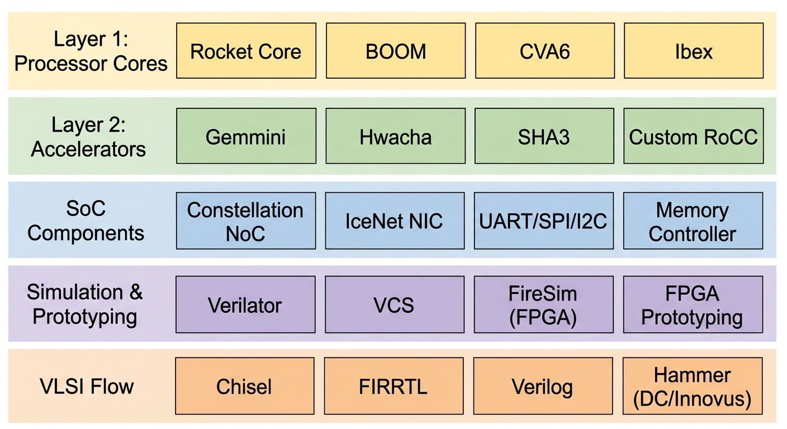

# Introduction: Why Chipyard

## The Problem

If you work in computer architecture research, there is one question you cannot avoid: **How do you build a processor platform that can actually run real software?**

Not just running a Hello World and calling it a day, but booting Linux, running real applications, and ideally being able to attach custom hardware modules on top. This is the prerequisite for validating any architecture research idea.

Building all of this from scratch -- a processor core, an OS port, a toolchain -- is a legitimate approach, and you will learn a lot doing it. But it takes a very long time, often measured in semesters or years. For students who are already doing research and need a verification platform quickly, that time cost is hard to justify.

This series takes a different path -- **using Chipyard directly**.

---

## What Is Chipyard

[Chipyard](https://github.com/ucb-bar/chipyard) is an open-source SoC design framework from UC Berkeley, built on the Chisel hardware description language. Its positioning has been **research-oriented** from the start: it does not teach you how to build a processor; instead, it gives you a ready-made infrastructure so you can focus on what you actually want to study.

The framework already integrates mature processor cores such as Rocket Core (in-order 5-stage pipeline) and BOOM (out-of-order superscalar), along with on-chip buses, memory controllers, and peripheral interfaces. It comes with Verilator/VCS simulation, FPGA prototyping, and tapeout backend support. If you need to add a custom accelerator, the RoCC and AXI4 interfaces let you plug one in directly.

Our research group's taped-out chips heavily reuse components from Chipyard -- once the RTL design is converted to Verilog, it feeds directly into the industry-standard backend flow (VCS -> Design Compiler -> Innovus). This framework is well-established in academia, and many works published at ISCA and MICRO use it for prototype validation.

---

## What You Can Do with Chipyard

Once you have the Chipyard environment set up, the path forward is clear.

Start by running functional simulation on a Rocket Core with Verilator to verify basic RISC-V instruction execution. After simulation is working, Rocket Core paired with a standard RISC-V Linux kernel can fully boot a Linux system -- being able to run Linux means the entire software ecosystem is available. Building on that, this series runs a custom LLM inference program on the RISC-V platform with a Gemmini systolic array accelerator, then analyzes performance bottlenecks using profiling.

From toolchain setup to running accelerated LLM inference on FPGA, the entire cycle is measured in weeks, not years.

---

## Roadmap for This Series

- **Prerequisites**: Setting up the development environment -- WSL2 + proxy + VSCode
- **Chapter 1**: Chipyard environment setup and toolchain overview
- **Chapter 2**: Your first Rocket Core -- running Hello World in simulation
- **Chapter 3**: The tapeout perspective -- where Chipyard fits in a real chip design flow
- **Chapter 4**: Booting Linux on FPGA -- theory
- **Chapter 5**: Booting Linux on FPGA -- practice and troubleshooting
- **Chapter 6**: Gemmini -- hardware-accelerated matrix operations on FPGA
- **Chapter 7**: LLM inference with Gemmini on FPGA

Each article documents the real pitfalls encountered along the way, not just the official documentation. Basic background in digital circuits and computer architecture is assumed -- no prior knowledge of Chisel or Chipyard is required.

Next up: **Prerequisites -- Development Environment Setup**.
